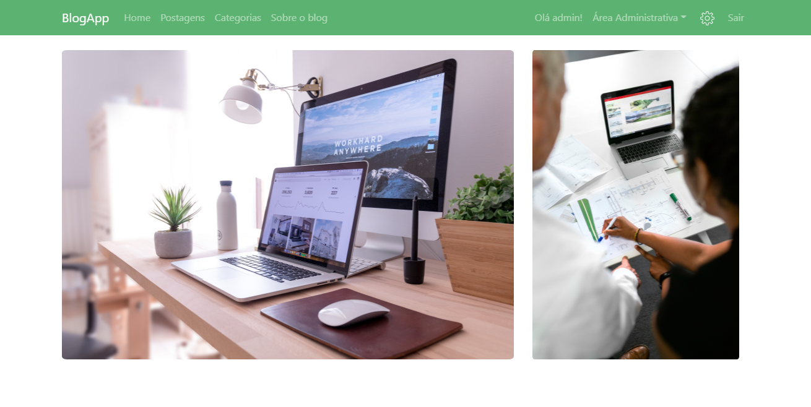

# Blogapp
> Blog desenvolvido em Node, sob as orientações de [Victor Lima](https://www.youtube.com/channel/UC_issB-37g9lwfAA37fy2Tg/playlists) em seu [Curso de Node.js](https://www.youtube.com/playlist?list=PLJ_KhUnlXUPtbtLwaxxUxHqvcNQndmI4B)



O blog está hospedado na [Heroku](https://blogapp-sabrinapoderis.herokuapp.com), onde foi salvo o projeto ensinado no curso, e também foi adicionado funcionalidades adicionais, como gerenciamento de usuários, postagens, e muito mais!

## Requisitos
- [Node](https://nodejs.org/en/download/)
- [MongoDB](https://www.mongodb.com/try/download/community)

## Instalação do projeto
Acesse a pasta principal do projeto através do terminal, e instale as dependências usando o NPM.

```sh
npm init
npm install
```

Utilize o comando 'node app.js' para executar o projeto.